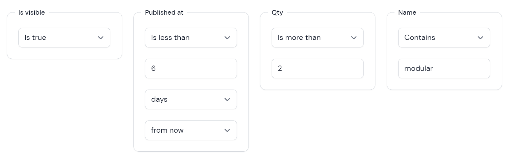

# Filament Advanced Filter



A collection of easy-to-use filters with clause conditions to [Filament](https://filamentphp.com)

## Installation

Install the package via composer (requires filament >= 2.10.40)
```bash
composer require webbingbrasil/filament-advancedfilter
```

Optionally you can publish the translation files

```php 
php artisan vendor:publish --tag="filament-advancedfilter-translations"
```

## Available Filters

### BooleanFilter

Filter records by boolean column:

```php
use Webbingbrasil\FilamentAdvancedFilter\Filters\BooleanFilter;

BooleanFilter::make('is_active')
```

In some cases you can have a `nullable` column, the BooleanFilter can handle nulls in different ways:

- Treats nulls as Unknown
- Treats nulls as True
- Treats nulls as False

by default `nulls` are treated as unknown and hidden

```php
BooleanFilter::make('is_active')->nullsAreUnknown();
BooleanFilter::make('is_active')->nullsAreTrue();
BooleanFilter::make('is_active')->nullsAreFalse();
BooleanFilter::make('is_active')->showUnknowns();
BooleanFilter::make('is_active')->hideUnknowns();
```

### DateFilter

Filter records by date/timestamp column:

```php
use Webbingbrasil\FilamentAdvancedFilter\Filters\DateFilter;

DateFilter::make('published_at')
```

This filter allows users to search records in the following conditions:

- Is equal/not equal to user's input
- Is on or after/before user's input
- Is more/less than user's input
  
    the user has the option to choose a **time interval** (day, week, month, year) in the **future/past**, for example:
  - more than 3 days from now
  - more than 4 months ago
  - less than 5 weeks from now
  - less than 6 days ago
  - more than 1 year ago

- Is between user's input
- Is set/not set


### NumberFilter

Filter records by numeric column:

```php
use Webbingbrasil\FilamentAdvancedFilter\Filters\NumberFilter;

NumberFilter::make('quantity')
```

This filter allows users to search records in the following conditions:

- Is equal/not equal to user's input
- Is on or after/before user's input
- Is more than/less than user's input
- Is between user's input
- Is set/not set

### TextFilter

Filter records by text column: 

```php
use Webbingbrasil\FilamentAdvancedFilter\Filters\NumberFilter;

TextFilter::make('name')
```

This filter allows users to search records in the following conditions:

- Is equal/not equal to user's input
- Starts/not starts with user's input
- Ends/not ends with user's input
- Contains/not contains user's input
- Is set/not set

## Set Default Clause

You can set a default clause condition for any filter, for example:

```php
use Webbingbrasil\FilamentAdvancedFilter\Filters\TextFilter;
use Webbingbrasil\FilamentAdvancedFilter\Filters\BooleanFilter;

FilamentAdvancedFilter\Filters\TextFilter::make('brand')
    ->relationship('brand', 'name')
    ->default(FilamentAdvancedFilter\Filters\TextFilter::CLAUSE_CONTAIN);
    
FilamentAdvancedFilter\Filters\BooleanFilter::make('is_visible')
    ->default(FilamentAdvancedFilter\Filters\BooleanFilter::CLAUSE_IS_FALSE);
```

## Enable Clause Label

By default the clause label is disabled, you can enable it by calling the `enableClauseLabel` method:

```php
use Webbingbrasil\FilamentAdvancedFilter\Filters\TextFilter;

FilamentAdvancedFilter\Filters\TextFilter::make('brand')
    ->enableClauseLabel()
```

## Fields Wrapper

You can change the wrapper for the filter fields, for example to use a Group component instead of Fieldset:

```php
use Webbingbrasil\FilamentAdvancedFilter\Filters\TextFilter;

FilamentAdvancedFilter\Filters\TextFilter::make('brand')
    ->enableClauseLabel()
    ->wrapperUsing(fn () => Forms\Components\Group::make())
```

## Field Debounce

You can set a custom debounce time for the filter fields, for example to wait 700ms before applying the filter:

```php
use Webbingbrasil\FilamentAdvancedFilter\Filters\TextFilter;

FilamentAdvancedFilter\Filters\TextFilter::make('brand')
    ->debounce(700)
```

By default the debounce time is 500ms.


## Credits

-   [Danilo Andrade](https://github.com/dmandrade)

## License

The MIT License (MIT). Please see [License File](LICENSE.md) for more information.
